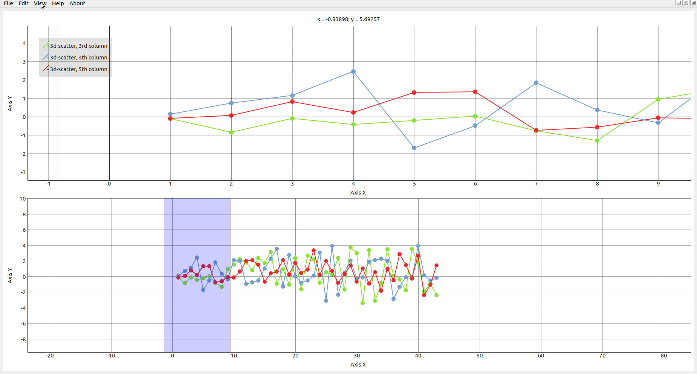

<div align="center">
<h1>DataVisualizer</h1>
<h4>Bachelor's Graduation Project: A Python-based visualization tool </h4>
</div>

<div align="center" width="80%" height="auto">
    
</div>

<div align="center" width="80%" height="auto">
    
</div>

# Initial goals

- To make a tool for simple yet clear visualizations of table format files, including: *csv*, *xls*, *SQL-tables*
- To be able to visualize selected cells with ability to reproduce the same code in other Python scripts
- To use the capabilities of various visual scientific Python libraries and to show how they can be combined together
- To be able to expand this project with custom types of visualizations

# This project may be of interest to:

- Students
- Researchers
- Software Developers

# A short example

1. Open a file (csv, xlsx, SQL-table)
2. Select some cells from a table
3. Group these cells by context menu option (a new Graphics Menu Instance will be created)
4. Choose a type of visualization (selected cells can be presented as 2D and 3D visualizations)
5. Click "Create a new plot" button
#


**Take a look at the ".github" folder for more different gifs / images of this tool.**

# Requirements:

Python 3.5 or newer.

A short list of used libraries:
- PyQt5
- Numpy
- Pandas
- xlrd
- psycopg2
- sqlalchemy
- Matplotlib
- pyqtgraph
- ...

A complete list of dependencies with versions is provided in the "requirements.txt" file.

# Strong points of this tool

- Cross-platform desktop application: Windows / Linux / Mac

- Easy-to-use: User-friendly Interface

- Multilingual

- Expandable


# Weak points

- All features were planned and implemented by me alone. That means there are areas which could be restructured/refactored/optimized.

# Main features

### Various types of visualizations:

<div align="center" width="80%" height="auto">
    
</div>

### An example of a custom visualization:

A line for measuring the distance between two selected curves:

<div align="center" width="80%" height="auto">
    
</div>

It was crucial to develop a movable line that would not disappear without a cursor in the scene. You can move the line and see the differences between the selected curves:

<div align="center" width="80%" height="auto">
    
</div>

### Ability to choose a formation (cascade / tiled / fullscreen) :

<div align="center" width="80%" height="auto">
    
</div>

### Responsive interface with a choice of language (English / Russian) :

<div align="center" width="80%" height="auto">
    
</div>

### Options and settings:

<div align="center" width="80%" height="auto">
    
</div>

### Cross-platform usage and more

Windows 10:
<div align="center" width="80%" height="auto">
    
</div>

Linux (Ubuntu 18.04, KDE Plasma):
<div align="center" width="80%" height="auto">
    
</div>

# Questions and Answers

### What makes this app unique?

The short answer would sound like:
- Interface: it is easy-to-use
- Code: DataVisualizer is an open-source Python-based project with self-explanatory code base
- Usability: this cross-platform tool provides files with additional explanations and examples
- Expandable parts: there are simple ways to expand types of visualizations by creating / adding Your own parts

### 3D data: what are the 1st type and the 2nd type of a 3D visualization?

The 1st type means that cells are stored as 1D array with one 2D array (1D and 1D meshgrid).

The 2nd type means that cells are stored as three 1D arrays. That is why 3D visualizations are not the same for the 1st and the 2nd types. 

You can open "options" of each graphics instance to see the differences by Yourself within DataVisualizer.
You can learn more about this in "help.txt", or right in the tool: Help -> Show help.

### Is it possible to add plotly/seaborn/other types of visualizations?

Yes, it is possible. You may use "PyQtWebEngine" for web-based visualizations.

### Why did I choose these combinations of libraries?

Based on my research the combination of PyQt5 with pandas, numpy, matplotlib and pyqtgraph was the best choice to create a desktop cross-platform app from scratch within a reasonable time. Another reason was that this combination was not that hard to be able to cover every aspect of development without a team.


# What I have managed to accomplish:
- Developed a complete software product
- Formed a habit to write code everyday
- Successfully defended thesis defence and was awarded a Bachelor's Degree certificate: Bachelor of Science in Computer Science.

# What I have managed to improve:
- Skills and knowledge in PyQt5, Pyqtgraph, Matplotlib, Numpy, Pandas
- Git/Github overall experience
- UI/UX design skills
- Ability to be able to present the results in both Russian and English
- English and Russian fluency in technical terms
- Ability to plan short and long term goals


# My Private Repo

I worked on this particular project from December (2019) to May (2020). My private repo contains private comments, that is why I decided to make a new public repo. There is a screenshot of my old private project. To clarify: my initial nickname was "alexLAP7", but I decided to change it to "alexLX7".

<div align="center">
  
</div>


# Future

All goals have been reached, there is no point for me to continue to work on it right now. So, unfortunatly, I'm not going to update this project.

Nevertheless, feel free to use and upgrade this tool. If You have any suggestions or corrections to make, please do not hesitate to let me know. 

# License

This project is based on PyQt5, therefore it is provided under GPL-3.0 License

Check the `pip-licenses` to learn more about various dependencies:

```
Name               License
PyQt5              GPL v3
SQLAlchemy         MIT
matplotlib         PSF
numpy              BSD
pandas             BSD
pyqtgraph          MIT
xlrd               BSD
...
```

# How to run the code

The following steps assume using VS Code. 

Open a terminal:


Create a virtual environment called 'venv':


```
python3 -m venv venv
```

Select 'venv' for the workspace folder by clicking 'Yes':


Activate Your 'venv' or simply open a new terminal in VS Code by clicking "Plus" symbol (near 'bash'), it will auto-activate it:


Install the requirements:


```
pip install -r requirements.txt
```

Run the code:

```
python3 main.py
```


# More:


- Check out "/datavisualizer/resources/help/" to see a tutorial on how You can reproduce the same types of visualizations in Your own scripts. That file is also can be opened within DataVisualizer

- Take a look at the ".github" folder for more different gifs / images of this tool


## Rate this project! :star:
### If You liked this repo, give it a star. Thanks!


